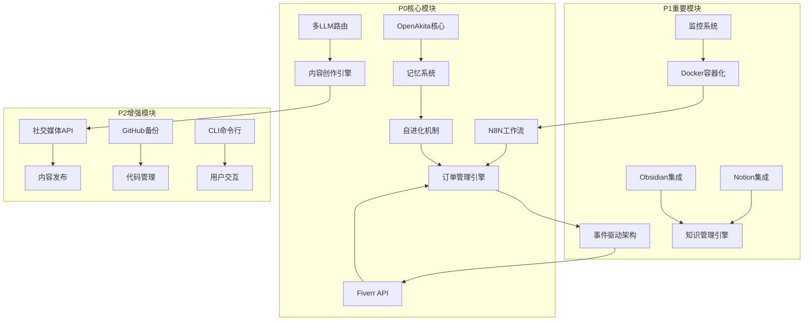

# AgentForge 项目落地方案

**方案编号**: AF-IMPL-2026-001  
**方案日期**: 2026 年 3 月 28 日  
**项目名称**: AgentForge 个人助理系统  
**方案版本**: V1.0  
**总工期**: 12-16 周

---

## 📋 方案摘要

本方案基于《AgentForge 个人助理系统架构规划方案》和《项目重建评估报告》，采用**渐进式重建策略**，在 12-16 周内完成系统性重建。核心目标是实现"数字分身"的核心价值主张，包括自进化能力、自动化运营和生态系统支持。

### 关键指标

| 指标 | 当前状态 | 目标状态 | 提升幅度 |
|------|---------|---------|---------|
| 核心价值实现 | 20% | 100% | +400% |
| 自动化程度 | 10% | 90% | +800% |
| 运营效率 | 30% | 95% | +217% |
| 技术债务 | 高 | 低 | -300% |

---

## 一、模块划分与任务分配

### 1.1 六层架构模块划分

```
┌─────────────────────────────────────────────────────────────────┐
│                    用户交互层 (User Interface)                    │
│  ┌─────────────┐ ┌─────────────┐ ┌─────────────┐ ┌───────────┐ │
│  │  Web前端    │ │ Tauri桌面端 │ │  CLI命令行  │ │ 通知系统  │ │
│  └─────────────┘ └─────────────┘ └─────────────┘ └───────────┘ │
└─────────────────────────────────────────────────────────────────┘
                                ↓
┌─────────────────────────────────────────────────────────────────┐
│                    集成接口层 (Integration Layer)                 │
│  ┌─────────────┐ ┌─────────────┐ ┌─────────────┐ ┌───────────┐ │
│  │ Fiverr API  │ │ 社交媒体API │ │  Notion API │ │ GitHub API│ │
│  └─────────────┘ └─────────────┘ └─────────────┘ └───────────┘ │
└─────────────────────────────────────────────────────────────────┘
                                ↓
┌─────────────────────────────────────────────────────────────────┐
│                   业务逻辑层 (Business Logic)                     │
│  ┌─────────────┐ ┌─────────────┐ ┌─────────────┐ ┌───────────┐ │
│  │ 订单管理引擎│ │ 内容创作引擎│ │ 知识管理引擎│ │沟通引擎   │ │
│  └─────────────┘ └─────────────┘ └─────────────┘ └───────────┘ │
└─────────────────────────────────────────────────────────────────┘
                                ↓
┌─────────────────────────────────────────────────────────────────┐
│                    AI能力层 (AI Capabilities)                     │
│  ┌─────────────┐ ┌─────────────┐ ┌─────────────┐ ┌───────────┐ │
│  │OpenAkita核心│ │ 多LLM路由   │ │  记忆系统   │ │自进化机制 │ │
│  └─────────────┘ └─────────────┘ └─────────────┘ └───────────┘ │
└─────────────────────────────────────────────────────────────────┘
                                ↓
┌─────────────────────────────────────────────────────────────────┐
│                   数据存储层 (Data Storage)                       │
│  ┌─────────────┐ ┌─────────────┐ ┌─────────────┐ ┌───────────┐ │
│  │ PostgreSQL  │ │   Redis     │ │   Qdrant    │ │ Obsidian  │ │
│  └─────────────┘ └─────────────┘ └─────────────┘ └───────────┘ │
└─────────────────────────────────────────────────────────────────┘
                                ↓
┌─────────────────────────────────────────────────────────────────┐
│                  基础设施层 (Infrastructure)                      │
│  ┌─────────────┐ ┌─────────────┐ ┌─────────────┐ ┌───────────┐ │
│  │   Docker    │ │  N8N工作流  │ │  监控系统   │ │ 日志系统  │ │
│  └─────────────┘ └─────────────┘ └─────────────┘ └───────────┘ │
└─────────────────────────────────────────────────────────────────┘
```

### 1.2 模块详细划分与负责人分配

#### 1.2.1 基础设施层模块

| 模块名称 | 功能描述 | 负责人Agent | 优先级 | 依赖模块 |
|---------|---------|------------|--------|---------|
| **Docker容器化** | 容器编排、镜像构建、服务管理 | DevOps工程师 | P1 | 无 |
| **N8N工作流引擎** | 工作流定义、执行、调度 | DevOps工程师 | P0 | Docker |
| **监控系统** | Prometheus+Grafana监控 | DevOps工程师 | P1 | Docker |
| **日志系统** | ELK/Loki日志聚合 | DevOps工程师 | P2 | Docker |
| **备份系统** | 数据备份与恢复 | DevOps工程师 | P1 | PostgreSQL |

#### 1.2.2 数据存储层模块

| 模块名称 | 功能描述 | 负责人Agent | 优先级 | 依赖模块 |
|---------|---------|------------|--------|---------|
| **PostgreSQL** | 业务数据存储 | 数据工程师 | P0 | Docker |
| **Redis** | 缓存与会话管理 | 数据工程师 | P0 | Docker |
| **Qdrant** | 向量检索引擎 | 数据工程师 | P0 | Docker |
| **Obsidian集成** | 本地知识库同步 | 软件工程师 | P1 | 无 |
| **Notion集成** | 云端协作空间 | 软件工程师 | P1 | 无 |

#### 1.2.3 AI能力层模块

| 模块名称 | 功能描述 | 负责人Agent | 优先级 | 依赖模块 |
|---------|---------|------------|--------|---------|
| **OpenAkita核心** | 自进化AI框架集成 | AI工程师 | P0 | 无 |
| **多LLM路由** | 智能模型选择与故障转移 | AI工程师 | P0 | 百度千帆 |
| **记忆系统** | 长短期记忆管理 | AI工程师 | P0 | OpenAkita |
| **自进化机制** | 记忆巩固、自我检查、自动复盘 | AI工程师 | P0 | 记忆系统 |
| **Prompt管理** | 模板管理、优化、版本控制 | AI工程师 | P1 | 无 |

#### 1.2.4 业务逻辑层模块

| 模块名称 | 功能描述 | 负责人Agent | 优先级 | 依赖模块 |
|---------|---------|------------|--------|---------|
| **订单管理引擎** | Fiverr订单自动化处理 | 软件工程师 | P0 | N8N, Fiverr API |
| **内容创作引擎** | 社交媒体内容生成与管理 | AI工程师 | P0 | 多LLM路由 |
| **知识管理引擎** | 文档管理、检索、同步 | 软件工程师 | P1 | Qdrant, Obsidian |
| **客户沟通引擎** | 消息管理、自动回复 | 软件工程师 | P1 | N8N |
| **项目管理引擎** | 任务跟踪、进度管理 | 软件工程师 | P2 | 无 |

#### 1.2.5 集成接口层模块

| 模块名称 | 功能描述 | 负责人Agent | 优先级 | 依赖模块 |
|---------|---------|------------|--------|---------|
| **Fiverr API** | 订单监控、消息同步 | 网络工程师 | P0 | 无 |
| **社交媒体API** | 多平台内容发布 | 网络工程师 | P2 | 无 |
| **Notion API** | 云端文档同步 | 网络工程师 | P1 | 无 |
| **GitHub API** | 代码备份、版本管理 | 网络工程师 | P2 | 无 |
| **LinkedIn API** | 个人品牌同步 | 网络工程师 | P3 | 无 |

#### 1.2.6 用户交互层模块

| 模块名称 | 功能描述 | 负责人Agent | 优先级 | 依赖模块 |
|---------|---------|------------|--------|---------|
| **Web前端** | React+Vite Web应用 | 前端工程师 | P0 | API层 |
| **Tauri桌面端** | 原生桌面应用 | 前端工程师 | P3 | Web前端 |
| **CLI命令行** | 终端交互界面 | 软件工程师 | P2 | API层 |
| **通知系统** | 实时推送、邮件通知 | 前端工程师 | P1 | 事件驱动 |

### 1.3 模块间依赖关系图



### 1.4 Agent角色与职责矩阵

| Agent角色 | 主要职责 | 负责模块 | 投入时间 |
|----------|---------|---------|---------|
| **架构师** | 架构设计、技术选型、代码审查 | 全局架构 | 全程 |
| **AI工程师** | AI模型集成、自进化机制 | AI能力层 | Week 3-12 |
| **软件工程师** | 核心功能开发、API开发 | 业务逻辑层、数据存储层 | 全程 |
| **前端工程师** | UI开发、交互优化 | 用户交互层 | Week 9-16 |
| **DevOps工程师** | 部署、监控、运维 | 基础设施层 | Week 1-2, 11-16 |
| **数据工程师** | 数据库设计、数据迁移 | 数据存储层 | Week 1-2, 13-14 |
| **网络工程师** | API集成、接口开发 | 集成接口层 | Week 3-12 |
| **测试工程师** | 测试、质量保障 | 全局测试 | Week 3-16 |
| **安全工程师** | 安全审计、漏洞修复 | 全局安全 | Week 13-14 |
| **产品经理** | 需求管理、进度跟踪 | 项目管理 | 全程 |

---

## 二、技术栈明细与版本要求

### 2.1 各层技术选型

#### 2.1.1 基础设施层

| 技术组件 | 版本要求 | 用途 | 备注 |
|---------|---------|------|------|
| **Docker** | 24.0+ | 容器化部署 | 必需 |
| **Docker Compose** | 2.20+ | 服务编排 | 必需 |
| **N8N** | 1.0+ | 工作流引擎 | 核心组件 |
| **Prometheus** | 2.45+ | 监控系统 | 推荐 |
| **Grafana** | 10.0+ | 可视化 | 推荐 |
| **Loki** | 2.9+ | 日志聚合 | 可选 |

#### 2.1.2 数据存储层

| 技术组件 | 版本要求 | 用途 | 备注 |
|---------|---------|------|------|
| **PostgreSQL** | 15+ | 关系型数据库 | 必需 |
| **Redis** | 7.0+ | 缓存/消息队列 | 必需 |
| **Qdrant** | 1.7+ | 向量数据库 | 必需 |
| **Obsidian** | 最新版 | 本地知识库 | 可选 |
| **Notion** | API v2022-06-28 | 云端协作 | 可选 |

#### 2.1.3 AI能力层

| 技术组件 | 版本要求 | 用途 | 备注 |
|---------|---------|------|------|
| **OpenAkita** | 最新稳定版 | 自进化AI框架 | 核心组件 |
| **百度千帆** | Coding Plan | 主力LLM服务 | 必需 |
| **Kimi-K2.5** | 最新版 | 备用模型 | 推荐 |
| **DeepSeek-V3.2** | 最新版 | 备用模型 | 推荐 |
| **GLM-5** | 最新版 | 备用模型 | 推荐 |

#### 2.1.4 业务逻辑层

| 技术组件 | 版本要求 | 用途 | 备注 |
|---------|---------|------|------|
| **Python** | 3.12+ | 后端开发语言 | 必需 |
| **FastAPI** | 0.109+ | Web框架 | 必需 |
| **Pydantic** | 2.5+ | 数据验证 | 必需 |
| **SQLAlchemy** | 2.0+ | ORM | 必需 |
| **Celery** | 5.3+ | 异步任务队列 | 推荐 |

#### 2.1.5 集成接口层

| 技术组件 | 版本要求 | 用途 | 备注 |
|---------|---------|------|------|
| **httpx** | 0.25+ | HTTP客户端 | 必需 |
| **aiohttp** | 3.9+ | 异步HTTP | 必需 |
| **tenacity** | 8.2+ | 重试机制 | 必需 |
| **OAuth2** | - | 认证协议 | 必需 |

#### 2.1.6 用户交互层

| 技术组件 | 版本要求 | 用途 | 备注 |
|---------|---------|------|------|
| **React** | 18.2+ | 前端框架 | 必需 |
| **TypeScript** | 5.4+ | 类型安全 | 必需 |
| **Vite** | 5.2+ | 构建工具 | 必需 |
| **Tailwind CSS** | 4.2+ | 样式框架 | 必需 |
| **Tauri** | 2.0+ | 桌面应用 | 可选 |

### 2.2 版本兼容性说明

#### 2.2.1 Python生态兼容性

```
Python 3.12+
├── FastAPI 0.109+ (兼容 Python 3.8+)
├── Pydantic 2.5+ (兼容 Python 3.8+)
├── SQLAlchemy 2.0+ (兼容 Python 3.7+)
├── Redis 5.0+ (兼容 Python 3.7+)
└── Qdrant Client 1.7+ (兼容 Python 3.8+)
```

#### 2.2.2 Node.js生态兼容性

```
Node.js 18+
├── React 18.2+ (兼容 Node.js 14+)
├── Vite 5.2+ (兼容 Node.js 18+)
├── TypeScript 5.4+ (兼容 Node.js 14+)
└── Tailwind CSS 4.2+ (兼容 Node.js 16+)
```

#### 2.2.3 Docker生态兼容性

```
Docker 24.0+
├── Docker Compose 2.20+ (兼容 Docker 20.10+)
├── PostgreSQL 15+ (官方镜像)
├── Redis 7.0+ (官方镜像)
├── Qdrant 1.7+ (官方镜像)
└── N8N 1.0+ (官方镜像)
```

### 2.3 依赖版本锁定策略

#### 2.3.1 Python依赖锁定

```txt
requirements.txt
├── 核心依赖：精确版本锁定 (==)
├── 次要依赖：兼容版本锁定 (>=, <)
└── 开发依赖：最小版本锁定 (>=)
```

#### 2.3.2 Node.js依赖锁定

```json
package.json
├── 核心依赖：精确版本锁定
├── 开发依赖：兼容版本锁定
└── 使用 package-lock.json 锁定完整依赖树
```

---

## 三、接口规范与数据模型

### 3.1 API接口规范

#### 3.1.1 RESTful API设计规范

**基础URL格式**

```
https://api.agentforge.local/v1/{resource}/{id}/{sub-resource}
```

**请求头规范**

```http
Content-Type: application/json
Authorization: Bearer {jwt_token}
X-Request-ID: {uuid}
X-API-Version: v1
```

**响应格式规范**

```json
{
  "code": 200,
  "message": "Success",
  "data": {
  },
  "meta": {
    "timestamp": "2026-03-28T10:00:00Z",
    "request_id": "uuid"
  }
}
```

**错误响应格式**

```json
{
  "code": 400,
  "message": "Bad Request",
  "errors": [
    {
      "field": "email",
      "message": "Invalid email format"
    }
  ],
  "meta": {
    "timestamp": "2026-03-28T10:00:00Z",
    "request_id": "uuid"
  }
}
```

#### 3.1.2 API端点规范

**订单管理API**

| 方法 | 端点 | 描述 | 权限 |
|------|------|------|------|
| GET | `/v1/orders` | 获取订单列表 | user |
| GET | `/v1/orders/{id}` | 获取订单详情 | user |
| POST | `/v1/orders` | 创建订单 | user |
| PUT | `/v1/orders/{id}` | 更新订单 | user |
| DELETE | `/v1/orders/{id}` | 删除订单 | admin |
| POST | `/v1/orders/{id}/deliver` | 交付订单 | user |

**知识库API**

| 方法 | 端点 | 描述 | 权限 |
|------|------|------|------|
| GET | `/v1/knowledge/documents` | 获取文档列表 | user |
| GET | `/v1/knowledge/documents/{id}` | 获取文档详情 | user |
| POST | `/v1/knowledge/documents` | 创建文档 | user |
| PUT | `/v1/knowledge/documents/{id}` | 更新文档 | user |
| DELETE | `/v1/knowledge/documents/{id}` | 删除文档 | user |
| POST | `/v1/knowledge/search` | 语义搜索 | user |

**内容创作API**

| 方法 | 端点 | 描述 | 权限 |
|------|------|------|------|
| POST | `/v1/content/generate` | 生成内容 | user |
| GET | `/v1/content/drafts` | 获取草稿列表 | user |
| POST | `/v1/content/drafts` | 保存草稿 | user |
| POST | `/v1/content/publish` | 发布内容 | user |

**AI对话API**

| 方法 | 端点 | 描述 | 权限 |
|------|------|------|------|
| POST | `/v1/chat/completions` | 对话补全 | user |
| POST | `/v1/chat/stream` | 流式对话 | user |
| GET | `/v1/chat/history` | 获取历史 | user |
| POST | `/v1/chat/clear` | 清空历史 | user |

#### 3.1.3 WebSocket接口规范

**连接URL**

```
wss://api.agentforge.local/v1/ws?token={jwt_token}
```

**消息格式**

```json
{
  "type": "message_type",
  "payload": {
  },
  "timestamp": "2026-03-28T10:00:00Z"
}
```

**消息类型**

| 类型 | 方向 | 描述 |
|------|------|------|
| `chat.message` | 双向 | 聊天消息 |
| `order.update` | 服务端推送 | 订单状态更新 |
| `notification` | 服务端推送 | 系统通知 |
| `ping` | 客户端发送 | 心跳检测 |
| `pong` | 服务端响应 | 心跳响应 |

### 3.2 数据库Schema设计

#### 3.2.1 核心表结构

**用户表 (users)**

```sql
CREATE TABLE users (
    id UUID PRIMARY KEY DEFAULT gen_random_uuid(),
    username VARCHAR(50) UNIQUE NOT NULL,
    email VARCHAR(255) UNIQUE NOT NULL,
    password_hash VARCHAR(255) NOT NULL,
    full_name VARCHAR(100),
    avatar_url TEXT,
    preferences JSONB DEFAULT '{}',
    is_active BOOLEAN DEFAULT true,
    is_superuser BOOLEAN DEFAULT false,
    created_at TIMESTAMP WITH TIME ZONE DEFAULT NOW(),
    updated_at TIMESTAMP WITH TIME ZONE DEFAULT NOW()
);

CREATE INDEX idx_users_email ON users(email);
CREATE INDEX idx_users_username ON users(username);
```

**订单表 (orders)**

```sql
CREATE TABLE orders (
    id UUID PRIMARY KEY DEFAULT gen_random_uuid(),
    user_id UUID NOT NULL REFERENCES users(id),
    fiverr_order_id VARCHAR(100) UNIQUE,
    buyer_name VARCHAR(100) NOT NULL,
    buyer_email VARCHAR(255),
    service_type VARCHAR(100) NOT NULL,
    description TEXT,
    price DECIMAL(10, 2) NOT NULL,
    currency VARCHAR(10) DEFAULT 'USD',
    status VARCHAR(50) NOT NULL DEFAULT 'pending',
    priority VARCHAR(20) DEFAULT 'normal',
    due_date TIMESTAMP WITH TIME ZONE,
    delivered_at TIMESTAMP WITH TIME ZONE,
    notes TEXT,
    metadata JSONB DEFAULT '{}',
    created_at TIMESTAMP WITH TIME ZONE DEFAULT NOW(),
    updated_at TIMESTAMP WITH TIME ZONE DEFAULT NOW()
);

CREATE INDEX idx_orders_user_id ON orders(user_id);
CREATE INDEX idx_orders_status ON orders(status);
CREATE INDEX idx_orders_fiverr_id ON orders(fiverr_order_id);
CREATE INDEX idx_orders_due_date ON orders(due_date);
```

**知识库文档表 (knowledge_documents)**

```sql
CREATE TABLE knowledge_documents (
    id UUID PRIMARY KEY DEFAULT gen_random_uuid(),
    user_id UUID NOT NULL REFERENCES users(id),
    title VARCHAR(255) NOT NULL,
    content TEXT,
    source VARCHAR(50) NOT NULL,
    source_url TEXT,
    tags TEXT[] DEFAULT '{}',
    category VARCHAR(100),
    vector_id UUID,
    metadata JSONB DEFAULT '{}',
    created_at TIMESTAMP WITH TIME ZONE DEFAULT NOW(),
    updated_at TIMESTAMP WITH TIME ZONE DEFAULT NOW()
);

CREATE INDEX idx_knowledge_user_id ON knowledge_documents(user_id);
CREATE INDEX idx_knowledge_source ON knowledge_documents(source);
CREATE INDEX idx_knowledge_tags ON knowledge_documents USING GIN(tags);
CREATE INDEX idx_knowledge_vector_id ON knowledge_documents(vector_id);
```

**内容草稿表 (content_drafts)**

```sql
CREATE TABLE content_drafts (
    id UUID PRIMARY KEY DEFAULT gen_random_uuid(),
    user_id UUID NOT NULL REFERENCES users(id),
    platform VARCHAR(50) NOT NULL,
    content TEXT NOT NULL,
    tone VARCHAR(50),
    tags TEXT[] DEFAULT '{}',
    status VARCHAR(20) DEFAULT 'draft',
    published_at TIMESTAMP WITH TIME ZONE,
    published_url TEXT,
    metadata JSONB DEFAULT '{}',
    created_at TIMESTAMP WITH TIME ZONE DEFAULT NOW(),
    updated_at TIMESTAMP WITH TIME ZONE DEFAULT NOW()
);

CREATE INDEX idx_content_user_id ON content_drafts(user_id);
CREATE INDEX idx_content_platform ON content_drafts(platform);
CREATE INDEX idx_content_status ON content_drafts(status);
```

**对话历史表 (chat_messages)**

```sql
CREATE TABLE chat_messages (
    id UUID PRIMARY KEY DEFAULT gen_random_uuid(),
    user_id UUID NOT NULL REFERENCES users(id),
    session_id UUID NOT NULL,
    role VARCHAR(20) NOT NULL,
    content TEXT NOT NULL,
    model VARCHAR(50),
    tokens_used INTEGER,
    metadata JSONB DEFAULT '{}',
    created_at TIMESTAMP WITH TIME ZONE DEFAULT NOW()
);

CREATE INDEX idx_chat_user_id ON chat_messages(user_id);
CREATE INDEX idx_chat_session_id ON chat_messages(session_id);
CREATE INDEX idx_chat_created_at ON chat_messages(created_at);
```

**自进化记忆表 (evolution_memories)**

```sql
CREATE TABLE evolution_memories (
    id UUID PRIMARY KEY DEFAULT gen_random_uuid(),
    user_id UUID NOT NULL REFERENCES users(id),
    memory_type VARCHAR(50) NOT NULL,
    content TEXT NOT NULL,
    importance_score DECIMAL(3, 2) DEFAULT 0.5,
    access_count INTEGER DEFAULT 0,
    last_accessed_at TIMESTAMP WITH TIME ZONE,
    vector_id UUID,
    metadata JSONB DEFAULT '{}',
    created_at TIMESTAMP WITH TIME ZONE DEFAULT NOW(),
    updated_at TIMESTAMP WITH TIME ZONE DEFAULT NOW()
);

CREATE INDEX idx_memories_user_id ON evolution_memories(user_id);
CREATE INDEX idx_memories_type ON evolution_memories(memory_type);
CREATE INDEX idx_memories_importance ON evolution_memories(importance_score DESC);
```

#### 3.2.2 向量数据库Schema

**Qdrant Collection配置**

```json
{
  "collection_name": "agentforge_knowledge",
  "vectors": {
    "size": 1536,
    "distance": "Cosine"
  },
  "payload_schema": {
    "document_id": "uuid",
    "user_id": "uuid",
    "title": "text",
    "source": "keyword",
    "tags": "keyword[]",
    "created_at": "datetime"
  }
}
```

### 3.3 消息格式定义

#### 3.3.1 事件消息格式

**订单事件**

```json
{
  "event_type": "order.created",
  "event_id": "uuid",
  "timestamp": "2026-03-28T10:00:00Z",
  "payload": {
    "order_id": "uuid",
    "user_id": "uuid",
    "fiverr_order_id": "string",
    "buyer_name": "string",
    "service_type": "string",
    "price": 100.00
  }
}
```

**内容生成事件**

```json
{
  "event_type": "content.generated",
  "event_id": "uuid",
  "timestamp": "2026-03-28T10:00:00Z",
  "payload": {
    "draft_id": "uuid",
    "user_id": "uuid",
    "platform": "twitter",
    "content": "string",
    "model_used": "glm-5"
  }
}
```

#### 3.3.2 N8N工作流消息格式

**工作流触发消息**

```json
{
  "workflow_id": "uuid",
  "trigger_type": "webhook|schedule|event",
  "payload": {
  },
  "context": {
    "user_id": "uuid",
    "session_id": "uuid"
  }
}
```

**工作流执行结果消息**

```json
{
  "workflow_id": "uuid",
  "execution_id": "uuid",
  "status": "success|failed",
  "result": {
  },
  "error": null,
  "duration_ms": 1234
}
```

---

## 四、质量标准与验收指标

### 4.1 代码质量标准

#### 4.1.1 代码规范要求

| 规范类型 | 工具 | 配置要求 | 检查时机 |
|---------|------|---------|---------|
| **Python代码规范** | Black + isort + Ruff | 强制执行 | 每次提交 |
| **TypeScript代码规范** | ESLint + Prettier | 强制执行 | 每次提交 |
| **SQL规范** | sqlfluff | 强制执行 | 每次提交 |
| **文档规范** | Markdownlint | 推荐执行 | PR合并前 |

#### 4.1.2 代码审查标准

**审查维度与通过标准**

| 审查维度 | 检查项 | 通过标准 |
|---------|--------|---------|
| **功能正确性** | 功能是否符合需求 | 100% 符合 |
| **代码质量** | 代码清晰、可维护 | 无严重问题 |
| **性能** | 无性能瓶颈 | P95 < 500ms |
| **安全** | 无安全风险 | 无高危漏洞 |
| **测试覆盖** | 单元测试覆盖率 | ≥80% |

#### 4.1.3 代码复杂度控制

| 指标 | 阈值 | 说明 |
|------|------|------|
| **函数圈复杂度** | ≤10 | 超过需重构 |
| **函数长度** | ≤50行 | 超过需拆分 |
| **类方法数** | ≤20 | 超过需拆分 |
| **文件行数** | ≤500行 | 超过需拆分 |

### 4.2 测试覆盖率要求

#### 4.2.1 测试金字塔

```
        /\
       /  \
      / E2E\         10% - 端到端测试
     /______\
    /        \
   / Integration \   20% - 集成测试
  /______________\
 /                \
/   Unit Tests     \ 70% - 单元测试
/__________________\
```

#### 4.2.2 覆盖率标准

| 测试类型 | 覆盖率要求 | 工具 | 说明 |
|---------|-----------|------|------|
| **单元测试** | ≥80% | pytest / Jest | 核心模块≥85% |
| **集成测试** | 关键路径100% | pytest | API端点全覆盖 |
| **端到端测试** | 核心流程100% | Playwright | 用户主流程 |
| **性能测试** | 关键接口100% | Locust | 高频接口 |
| **安全测试** | 全量扫描 | OWASP ZAP | 每次发布前 |

#### 4.2.3 测试环境要求

| 环境 | 用途 | 数据 | 访问权限 |
|------|------|------|---------|
| **开发环境** | 开发调试 | 模拟数据 | 开发团队 |
| **测试环境** | 功能测试 | 测试数据 | 测试团队 |
| **预发布环境** | 验收测试 | 生产数据副本 | 项目团队 |
| **生产环境** | 真实运行 | 真实数据 | 用户 |

### 4.3 性能指标

#### 4.3.1 API性能指标

| 指标 | 目标值 | 测量方法 | 告警阈值 |
|------|--------|---------|---------|
| **API响应时间** | P95 < 500ms | APM监控 | >1s |
| **页面加载时间** | < 2s | Lighthouse | >3s |
| **并发用户数** | ≥10 | 压力测试 | - |
| **数据库查询** | < 100ms | 慢查询日志 | >500ms |
| **LLM请求成功率** | >99% | 日志分析 | <95% |

#### 4.3.2 系统性能指标

| 指标 | 目标值 | 测量方法 | 告警阈值 |
|------|--------|---------|---------|
| **CPU使用率** | <70% | Prometheus | >80% |
| **内存使用率** | <80% | Prometheus | >85% |
| **磁盘使用率** | <80% | Prometheus | >85% |
| **网络延迟** | <50ms | Prometheus | >100ms |
| **系统可用性** | >99% | Uptime监控 | <99% |

#### 4.3.3 性能测试计划

| 测试类型 | 测试场景 | 通过标准 | 执行频率 |
|---------|---------|---------|---------|
| **负载测试** | 10并发用户 | 响应时间<500ms | 每周 |
| **压力测试** | 逐步增加到50用户 | 系统不崩溃 | 每月 |
| **稳定性测试** | 10用户持续24小时 | 无内存泄漏 | 每月 |
| **容量测试** | 确定系统容量上限 | 记录上限值 | 每季度 |

### 4.4 安全标准

#### 4.4.1 安全检查清单

| 安全维度 | 检查项 | 工具/方法 | 执行频率 |
|---------|--------|----------|---------|
| **认证授权** | JWT安全、权限控制 | 代码审查 | 每次发布 |
| **数据加密** | 敏感数据加密存储 | 安全扫描 | 每次发布 |
| **API安全** | 输入验证、SQL注入防护 | OWASP ZAP | 每次发布 |
| **依赖安全** | 第三方库漏洞扫描 | Snyk | 每日自动 |
| **配置安全** | 敏感配置不暴露 | 配置审查 | 每次发布 |

#### 4.4.2 安全审计要求

| 审计类型 | 频率 | 执行者 | 输出物 |
|---------|------|--------|--------|
| **代码安全审计** | 每次发布前 | 安全工程师 | 审计报告 |
| **依赖安全扫描** | 每日自动 | CI/CD | 扫描报告 |
| **渗透测试** | 上线前 | 安全团队 | 测试报告 |
| **安全培训** | 每月 | 安全工程师 | 培训记录 |

#### 4.4.3 数据安全要求

| 数据类型 | 加密方式 | 存储位置 | 访问控制 |
|---------|---------|---------|---------|
| **用户密码** | bcrypt哈希 | PostgreSQL | 系统内部 |
| **API密钥** | AES-256加密 | 环境变量 | 系统内部 |
| **敏感业务数据** | AES-256加密 | PostgreSQL | 用户授权 |
| **向量数据** | 无加密 | Qdrant | 用户授权 |
| **日志数据** | 无加密 | Loki | 系统管理员 |

### 4.5 验收标准

#### 4.5.1 功能验收标准

| 功能模块 | 验收标准 | 验收方法 |
|---------|---------|---------|
| **OpenAkita集成** | 自进化机制正常运行 | 功能测试 |
| **N8N工作流** | 工作流可创建、执行、监控 | 集成测试 |
| **Fiverr API** | 订单实时同步、Webhook正常 | 集成测试 |
| **知识库** | 文档CRUD、语义搜索正常 | 功能测试 |
| **内容创作** | 内容生成、发布流程正常 | 功能测试 |
| **用户认证** | 注册、登录、权限控制正常 | 安全测试 |

#### 4.5.2 非功能验收标准

| 维度 | 验收标准 | 验收方法 |
|------|---------|---------|
| **性能** | API响应P95<500ms | 性能测试 |
| **安全** | 无高危漏洞 | 安全扫描 |
| **可用性** | 系统可用性>99% | 监控验证 |
| **可维护性** | 代码覆盖率≥80% | 测试报告 |
| **文档完整性** | 所有文档已更新 | 文档审查 |

---

## 五、开发进度安排

### 5.1 里程碑定义

| 里程碑 | 时间 | 标志 | 验收标准 |
|--------|------|------|---------|
| **M0 - 项目启动** | Week 2 | 准备完成 | 开发环境就绪、方案确定 |
| **M1 - 核心重建** | Week 8 | 核心功能完成 | OpenAkita集成、自进化可用 |
| **M2 - 功能完善** | Week 12 | 功能完整 | 所有P0/P1功能完成 |
| **M3 - 项目上线** | Week 16 | 上线完成 | 生产环境稳定运行 |

### 5.2 详细时间表

#### 5.2.1 第0阶段：准备阶段（Week 1-2）

**Week 1：环境准备与架构研究**

| 任务 | 工作量 | 负责人 | 输出物 | 依赖 |
|------|--------|--------|--------|------|
| OpenAkita架构研究 | 3天 | 架构师 | 架构分析报告 | 无 |
| 迁移方案设计 | 2天 | 架构师 | 迁移方案文档 | 无 |
| 开发环境搭建 | 2天 | DevOps工程师 | 开发环境 | 无 |
| 技术选型确认 | 1天 | 架构师 | 技术选型文档 | 架构研究 |

**Week 2：团队培训与计划细化**

| 任务 | 工作量 | 负责人 | 输出物 | 依赖 |
|------|--------|--------|--------|------|
| 团队培训 | 2天 | 架构师 | 培训记录 | Week 1 |
| 开发计划细化 | 2天 | 产品经理 | 详细计划文档 | Week 1 |
| 数据库结构对比 | 2天 | 数据工程师 | 结构差异文档 | 无 |
| 迁移脚本开发 | 1天 | 软件工程师 | 迁移脚本 | 结构对比 |

**里程碑M0验收**：
- [ ] 开发环境就绪
- [ ] 技术选型确定
- [ ] 迁移方案完成
- [ ] 团队培训完成

#### 5.2.2 第一阶段：核心重建（Week 3-8）

**Week 3-4：OpenAkita核心集成**

| 任务 | 工作量 | 负责人 | 输出物 | 依赖 |
|------|--------|--------|--------|------|
| OpenAkita源码研究 | 3天 | AI工程师 | 研究报告 | M0 |
| 核心模块集成 | 5天 | AI工程师 | 集成代码 | 源码研究 |
| API层适配 | 3天 | 软件工程师 | API代码 | 核心集成 |
| 单元测试 | 2天 | 测试工程师 | 测试代码 | API适配 |

**Week 5-6：自进化机制实现**

| 任务 | 工作量 | 负责人 | 输出物 | 依赖 |
|------|--------|--------|--------|------|
| 记忆巩固系统 | 4天 | AI工程师 | 记忆系统代码 | OpenAkita集成 |
| 自我检查系统 | 4天 | AI工程师 | 检查系统代码 | 记忆系统 |
| 自动复盘系统 | 3天 | AI工程师 | 复盘系统代码 | 自我检查 |
| 进化报告生成 | 2天 | AI工程师 | 报告生成代码 | 自动复盘 |
| 集成测试 | 2天 | 测试工程师 | 测试报告 | 所有系统 |

**Week 7-8：N8N工作流引擎 + Fiverr API**

| 任务 | 工作量 | 负责人 | 输出物 | 依赖 |
|------|--------|--------|--------|------|
| N8N部署和配置 | 2天 | DevOps工程师 | N8N环境 | M0 |
| N8N与系统集成 | 3天 | 软件工程师 | 集成代码 | N8N部署 |
| Fiverr API申请 | 1天 | 产品经理 | API访问权限 | 无 |
| Fiverr API集成 | 4天 | 网络工程师 | 集成代码 | API批准 |
| Webhook实现 | 2天 | 软件工程师 | Webhook代码 | API集成 |
| 端到端测试 | 3天 | 测试工程师 | 测试报告 | 所有功能 |

**里程碑M1验收**：
- [ ] OpenAkita集成完成
- [ ] 自进化机制可用
- [ ] N8N工作流正常
- [ ] Fiverr API集成完成
- [ ] 单元测试覆盖率≥80%
- [ ] 无高危安全问题

#### 5.2.3 第二阶段：功能完善（Week 9-12）

**Week 9-10：事件驱动 + 外部集成**

| 任务 | 工作量 | 负责人 | 输出物 | 依赖 |
|------|--------|--------|--------|------|
| Redis Streams集成 | 2天 | 软件工程师 | 事件系统代码 | M1 |
| 事件发布/订阅实现 | 3天 | 软件工程师 | 事件处理代码 | Redis Streams |
| Notion API集成 | 3天 | 网络工程师 | 集成代码 | M1 |
| Obsidian同步实现 | 3天 | 软件工程师 | 同步代码 | M1 |
| 集成测试 | 2天 | 测试工程师 | 测试报告 | 所有集成 |

**Week 11-12：容器化 + Agent Skills**

| 任务 | 工作量 | 负责人 | 输出物 | 依赖 |
|------|--------|--------|--------|------|
| Dockerfile编写 | 2天 | DevOps工程师 | Dockerfile | M1 |
| docker-compose配置 | 2天 | DevOps工程师 | compose文件 | Dockerfile |
| 部署脚本编写 | 2天 | DevOps工程师 | 部署脚本 | compose |
| Agent Skills接口设计 | 2天 | 架构师 | 接口文档 | M1 |
| 核心技能开发 | 4天 | AI工程师 | 技能代码 | 接口设计 |
| 集成测试 | 2天 | 测试工程师 | 测试报告 | 所有功能 |

**里程碑M2验收**：
- [ ] 事件驱动架构完成
- [ ] Notion/Obsidian集成完成
- [ ] Docker容器化完成
- [ ] Agent Skills系统可用
- [ ] 所有P0/P1功能完成
- [ ] 性能指标达标

#### 5.2.4 第三阶段：优化上线（Week 13-16）

**Week 13-14：优化和测试**

| 任务 | 工作量 | 负责人 | 输出物 | 依赖 |
|------|--------|--------|--------|------|
| 性能优化 | 3天 | 软件工程师 | 优化报告 | M2 |
| 安全审计 | 3天 | 安全工程师 | 审计报告 | M2 |
| Bug修复 | 3天 | 开发团队 | 修复记录 | 测试反馈 |
| 用户验收测试 | 3天 | 用户+测试 | UAT报告 | Bug修复 |
| 文档完善 | 2天 | 开发团队 | 完整文档 | 所有功能 |

**Week 15-16：部署和监控**

| 任务 | 工作量 | 负责人 | 输出物 | 依赖 |
|------|--------|--------|--------|------|
| 生产环境部署 | 2天 | DevOps工程师 | 生产环境 | M2 |
| 数据迁移 | 2天 | 数据工程师 | 迁移报告 | 部署 |
| 监控系统配置 | 2天 | DevOps工程师 | 监控系统 | 部署 |
| 灰度发布 | 3天 | DevOps工程师 | 发布记录 | 监控配置 |
| 全量发布 | 1天 | DevOps工程师 | 发布记录 | 灰度验证 |
| 上线后监控 | 3天 | 运维团队 | 监控报告 | 全量发布 |

**里程碑M3验收**：
- [ ] 生产环境稳定运行
- [ ] 数据迁移完成
- [ ] 监控系统正常
- [ ] UAT通过
- [ ] 文档完整
- [ ] 系统可用性>99%

### 5.3 关键路径分析

#### 5.3.1 关键路径

```
M0 → OpenAkita集成 → 自进化机制 → N8N集成 → M1 → 事件驱动 → M2 → 性能优化 → M3
```

**关键路径总工期**：14周

#### 5.3.2 关键路径任务

| 任务 | 工期 | 浮动时间 | 风险等级 |
|------|------|---------|---------|
| OpenAkita核心集成 | 2周 | 0 | 高 |
| 自进化机制实现 | 2周 | 0 | 高 |
| N8N工作流集成 | 2周 | 0 | 中 |
| 事件驱动架构 | 2周 | 1周 | 中 |
| 性能优化与测试 | 2周 | 1周 | 中 |

#### 5.3.3 非关键路径任务

| 任务 | 工期 | 浮动时间 | 可并行性 |
|------|------|---------|---------|
| Docker容器化 | 1周 | 2周 | 可并行 |
| Notion/Obsidian集成 | 1周 | 2周 | 可并行 |
| Agent Skills开发 | 1周 | 1周 | 可并行 |
| 文档完善 | 1周 | 2周 | 可并行 |

### 5.4 风险缓冲

#### 5.4.1 时间缓冲

- **每个阶段预留**：1周缓冲时间
- **总缓冲时间**：4周（包含在16周内）
- **关键路径缓冲**：2周

#### 5.4.2 资源缓冲

- **人力备份**：每个角色至少1名备份人员
- **环境备份**：测试环境、预发布环境
- **数据备份**：每日自动备份

---

## 六、风险识别与应对

### 6.1 技术风险

#### 6.1.1 风险清单

| 风险ID | 风险描述 | 概率 | 影响 | 风险等级 |
|--------|---------|------|------|---------|
| TR-01 | OpenAkita集成困难 | 中 | 高 | 🔴 高 |
| TR-02 | 数据迁移失败 | 低 | 高 | 🟡 中 |
| TR-03 | 性能不达标 | 中 | 中 | 🟡 中 |
| TR-04 | 第三方API限制 | 中 | 中 | 🟡 中 |
| TR-05 | 自进化机制效果不佳 | 中 | 高 | 🔴 高 |
| TR-06 | N8N工作流复杂度高 | 低 | 中 | 🟢 低 |

#### 6.1.2 应对措施

**TR-01: OpenAkita集成困难**

| 应对策略 | 具体措施 | 负责人 | 触发条件 |
|---------|---------|--------|---------|
| **预防** | 提前2周进行技术预研 | AI工程师 | 项目启动 |
| **缓解** | 准备备选方案（LangChain） | 架构师 | 集成受阻 |
| **应急** | 简化功能范围，分阶段集成 | 产品经理 | 严重延期 |
| **监控** | 每日进度跟踪 | 产品经理 | 集成期间 |

**TR-02: 数据迁移失败**

| 应对策略 | 具体措施 | 负责人 | 触发条件 |
|---------|---------|--------|---------|
| **预防** | 充分测试迁移脚本 | 数据工程师 | 迁移前 |
| **缓解** | 保留旧数据库作为备份 | DevOps工程师 | 迁移开始 |
| **应急** | 执行回滚脚本 | 数据工程师 | 迁移失败 |
| **监控** | 数据完整性验证 | 测试工程师 | 迁移后 |

**TR-05: 自进化机制效果不佳**

| 应对策略 | 具体措施 | 负责人 | 触发条件 |
|---------|---------|--------|---------|
| **预防** | 参考OpenAkita最佳实践 | AI工程师 | 设计阶段 |
| **缓解** | 调整参数和策略 | AI工程师 | 效果不佳 |
| **应急** | 简化为规则引擎 | 架构师 | 效果很差 |
| **监控** | 定期评估进化效果 | 产品经理 | 上线后 |

### 6.2 进度风险

#### 6.2.1 风险清单

| 风险ID | 风险描述 | 概率 | 影响 | 风险等级 |
|--------|---------|------|------|---------|
| SR-01 | 需求变更频繁 | 高 | 中 | 🟡 中 |
| SR-02 | 关键人员变动 | 中 | 高 | 🔴 高 |
| SR-03 | 技术难点超预期 | 中 | 中 | 🟡 中 |
| SR-04 | 外部依赖延迟 | 中 | 中 | 🟡 中 |
| SR-05 | 测试发现重大缺陷 | 中 | 高 | 🔴 高 |

#### 6.2.2 应对措施

**SR-01: 需求变更频繁**

| 应对策略 | 具体措施 | 负责人 | 触发条件 |
|---------|---------|--------|---------|
| **预防** | 需求冻结机制 | 产品经理 | M0后 |
| **缓解** | 变更影响评估 | 架构师 | 变更请求 |
| **应急** | 推迟到下一版本 | 产品经理 | 影响大 |
| **监控** | 变更请求跟踪 | 产品经理 | 全程 |

**SR-02: 关键人员变动**

| 应对策略 | 具体措施 | 负责人 | 触发条件 |
|---------|---------|--------|---------|
| **预防** | 文档完善、知识共享 | 架构师 | 全程 |
| **缓解** | 交叉培训 | 团队 | 定期 |
| **应急** | 外部资源支持 | 产品经理 | 人员离职 |
| **监控** | 团队稳定性评估 | 产品经理 | 每周 |

**SR-05: 测试发现重大缺陷**

| 应对策略 | 具体措施 | 负责人 | 触发条件 |
|---------|---------|--------|---------|
| **预防** | 代码审查、单元测试 | 开发团队 | 开发期间 |
| **缓解** | 快速修复流程 | 开发团队 | 发现缺陷 |
| **应急** | 回退到稳定版本 | DevOps工程师 | 严重缺陷 |
| **监控** | 缺陷趋势分析 | 测试工程师 | 测试期间 |

### 6.3 资源风险

#### 6.3.1 风险清单

| 风险ID | 风险描述 | 概率 | 影响 | 风险等级 |
|--------|---------|------|------|---------|
| RR-01 | 服务器资源不足 | 低 | 中 | 🟢 低 |
| RR-02 | API配额限制 | 中 | 中 | 🟡 中 |
| RR-03 | 预算超支 | 低 | 中 | 🟢 低 |
| RR-04 | 第三方服务中断 | 低 | 中 | 🟢 低 |

#### 6.3.2 应对措施

**RR-02: API配额限制**

| 应对策略 | 具体措施 | 负责人 | 触发条件 |
|---------|---------|--------|---------|
| **预防** | 配额监控和预警 | DevOps工程师 | 上线后 |
| **缓解** | 多模型负载均衡 | AI工程师 | 接近限制 |
| **应急** | 降级到备用模型 | AI工程师 | 超出限制 |
| **监控** | 每日配额使用报告 | DevOps工程师 | 全程 |

### 6.4 业务风险

#### 6.4.1 风险清单

| 风险ID | 风险描述 | 概率 | 影响 | 风险等级 |
|--------|---------|------|------|---------|
| BR-01 | 业务中断 | 低 | 高 | 🟡 中 |
| BR-02 | 数据丢失 | 低 | 极高 | 🔴 高 |
| BR-03 | 用户体验下降 | 中 | 中 | 🟡 中 |
| BR-04 | 用户接受度低 | 中 | 中 | 🟡 中 |

#### 6.4.2 应对措施

**BR-02: 数据丢失**

| 应对策略 | 具体措施 | 负责人 | 触发条件 |
|---------|---------|--------|---------|
| **预防** | 多重备份机制 | DevOps工程师 | 上线前 |
| **缓解** | 实时数据同步 | 数据工程师 | 运行期间 |
| **应急** | 数据恢复流程 | DevOps工程师 | 数据丢失 |
| **监控** | 备份完整性检查 | DevOps工程师 | 每日 |

**BR-03: 用户体验下降**

| 应对策略 | 具体措施 | 负责人 | 触发条件 |
|---------|---------|--------|---------|
| **预防** | 充分的UAT测试 | 测试工程师 | 上线前 |
| **缓解** | 快速反馈渠道 | 前端工程师 | 上线后 |
| **应急** | 快速回滚机制 | DevOps工程师 | 严重问题 |
| **监控** | 用户满意度调查 | 产品经理 | 定期 |

### 6.5 风险监控与报告

#### 6.5.1 风险监控机制

| 监控活动 | 频率 | 负责人 | 输出物 |
|---------|------|--------|--------|
| **风险评审会议** | 每周 | 产品经理 | 风险状态报告 |
| **风险登记册更新** | 每周 | 产品经理 | 更新后的登记册 |
| **风险触发检查** | 每日 | 各负责人 | 预警通知 |
| **应急演练** | 每月 | DevOps工程师 | 演练报告 |

#### 6.5.2 风险报告模板

```markdown
## 风险状态周报

**报告日期**: YYYY-MM-DD
**报告人**: XXX

### 风险概览
- 高风险: X个
- 中风险: X个
- 低风险: X个

### 本周新增风险
| 风险ID | 描述 | 等级 | 应对措施 |
|--------|------|------|---------|

### 本周关闭风险
| 风险ID | 描述 | 关闭原因 |
|--------|------|---------|

### 需要关注的风险
| 风险ID | 当前状态 | 下周计划 |
|--------|---------|---------|
```

---

## 七、附录

### 7.1 术语表

| 术语 | 说明 |
|------|------|
| **OpenAkita** | 开源AI Agent框架，支持自进化能力 |
| **N8N** | 开源工作流自动化工具 |
| **MCP** | Model Context Protocol，模型上下文协议 |
| **Agent Skills** | Agent技能插件系统 |
| **自进化** | 系统自动学习和改进的能力 |
| **记忆巩固** | 提取重要信息并建立关联的过程 |
| **自我检查** | 系统自动检测错误并生成修复建议 |
| **自动复盘** | 任务完成后自动分析执行情况 |

### 7.2 参考文档

1. AgentForge 个人助理系统架构规划方案 V1.0
2. AgentForge 项目重建评估报告
3. AgentForge 项目现状与架构规划对比分析报告
4. OpenAkita 官方文档
5. N8N 官方文档
6. 百度千帆API文档

### 7.3 变更记录

| 版本 | 日期 | 变更内容 | 变更人 |
|------|------|---------|--------|
| V1.0 | 2026-03-28 | 初始版本 | 项目规划团队 |

---

**方案编制**: 项目规划团队  
**方案审核**: 技术委员会  
**方案批准**: 项目负责人

**方案状态**: 最终版  
**保密级别**: 内部公开

---

*本方案基于 2026 年 3 月 28 日的项目状态进行规划，建议在项目启动前进行更新评估。*
